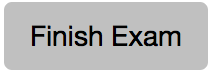

.. qnum::
   :Prefix: 4-3-
   :start: 1
   
.. |runbutton| image:: Figures/run-button.png
    :height: 20px
    :align: top
    :alt: run button   
    
.. |pass| image:: Figures/pass.png
    :height: 20px
    :align: top
    :alt: pass
    
.. |fail| image:: Figures/fail.png
    :height: 20px
    :align: top
    :alt: fail
    
.. |start| image:: Figures/start.png
    :height: 24px
    :align: top
    :alt: start
    
.. |checkme| image:: Figures/checkMe.png
    :height: 20px
    :align: top
    :alt: check me
    

    
.. |right| image:: Figures/rightArrow.png
    :height: 24px
    :align: top
    :alt: right arrow for next page
            

Posttest Order Code Problem
----------------------------

Construct the function ``isLevelSeg(numList, first, last)``, which returns ``True`` when a trail segment is level and ``False`` otherwise.
A trail segment is defined by a first index, a last index, and all indicies between those two (including the first and last indicies). The parameters of the method are the list of elevation values, the first index, and the last index.

The method should return true if the difference
between the largest value and the smallest value in the trail segment is less than or equal to
10. 

Examples
============

For the data shown in Figure 1 below, the trail segment starting at index 7 and ending at index 9 has values ranging from 70 to 75.  Because the difference between 75 and 70 is less than 10 it is considered level.  The trail segment starting at index 7 and ending at
index 10 has values ranging between 70 and 80. Because the difference between 80 and 70 is
equal to 10, the trail segment is also considered level.
The trail segment starting at marker 2 and ending at marker 12 has values ranging between 50 and
120 meters. Because the difference between 120 and 50 is greater than 10, this trail segment is not considered level.

.. figure:: Figures/trailMarkers.png
    :width: 500px
    :align: center
    :figclass: align-center

    Figure 1: The data values as a graph and as a table

See the table below for a summary of the examples above.  

======= ===== =======  ====== ================  ===========
First   Last  Highest  Lowest Difference <= 10   is Level?
======= ===== =======  ====== ================  ===========
   7      9      75      70          5			  True
   7     10      80      70         10            True
   2     12     120      50         70            False
======= ===== =======  ====== ================  ===========

Order Code Here
================

Click on the |start| button below when you are ready to try to order this code.  You will have up to 10 lowestutes to try to solve it.  Click on the |checkme| button to check your solution.  Click on the |finish| button when you have solved this problem or wish to move on without solving it.

.. timed:: Posttest_is_stable
   :timelimit: 10
   :noresult:
   :nofeedback:
   :fullwidth:
   
   .. parsonsprob:: Posttest2_Order_Is_Level
      :order: 8,0,13,4,10,7,1,5,12,9,2,11,3,6
   
      The code below is mixed up and contains extra blocks that are not needed.  Drag the needed code from the left to the right and put them in order with the correct indention so that the code would work correctly.  
      -----
      def isLevelSeg(numList, first, last):
      =====
          highest = numList[first]
      =====
          highest = numList[0] #distractor
      =====
      	  lowest = highest
      =====
          for index in range(first,last+1):
      =====
          for index in range(first,last): #distractor
      =====
      	      value = numList[index]
              if value > highest: 
      =====
                  highest = value
      =====
                  value = highest #distractor
      =====
              if value < lowest:
      =====        
              if lowest < value: #distractor
      =====
                  lowest = value
      =====
          return (highest - lowest) <= 10
      =====
          return (highest - lowest) >= 10 #distractor
          
When you are finished with this problem, or are ready to move on, click the |finish| button and then go to the next page by clicking the right arrow |right| near the bottom right of this page.    
